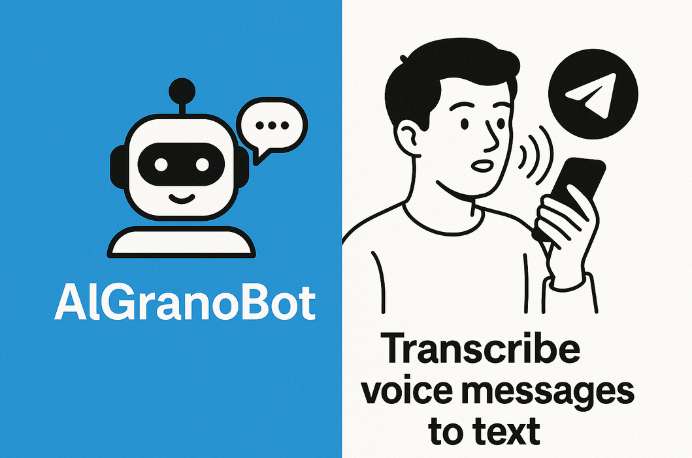

# AlGranoBot 🤖🎙️

<p align="center">
  
</p>

Welcome to **AlGranoBot**, your local whisper-powered Telegram sidekick that transcribes voice messages and audio files with lightning speed and precision. Powered by the blazing-fast [faster-whisper](https://github.com/guillaumekln/faster-whisper) model, this bot runs locally, no cloud required — perfect for privacy-conscious geeks and audio aficionados alike.

---

## 🚀 Features

- Transcribe voice messages and audio files sent directly in Telegram
- Supports multiple audio formats: **OGG, MP3, M4A, WAV, FLAC, AAC**
- Automatic format conversion for optimal compatibility
- Runs locally with optional GPU acceleration for turbocharged transcription
- Minimal dependencies, easy to deploy with Docker or manually

---

## 📋 Supported Formats

AlGranoBot supports a wide range of audio formats:

- **OGG** - Default Telegram voice message format
- **MP3** - Popular compressed audio format
- **M4A** - Apple's audio format (AAC in MP4 container)
- **WAV** - Uncompressed audio format
- **FLAC** - Lossless compressed audio
- **AAC** - Advanced Audio Coding

The bot automatically detects the format and converts files when necessary for optimal transcription quality.

---

## 🛠️ Prerequisites

- Docker & Docker Compose (recommended) **or** Python 3.9+
- A Telegram bot token from [@BotFather](https://t.me/BotFather)
- Optional: CUDA-enabled GPU for faster transcription (see GPU section)

---

## ⚙️ Environment Variables

- `TELEGRAM_BOT_TOKEN` - Your Telegram bot token (required)
- `ALLOWED_USERS` - (Optional) Comma-separated list of allowed Telegram user IDs or chat IDs that the bot will respond to. If unset or empty, the bot will respond to all users.

---

## 🐳 Installation & Running

### Using Docker Compose (Recommended)

1. Clone this repo and navigate to the `AlGranoBot` directory:
   ```bash
   git clone <repo-url>
   cd AlGranoBot
   ```

2. Create a `.env` file with your bot token:
   ```
   TELEGRAM_BOT_TOKEN=your_bot_token_here
   ```

3. Build and start the container:
   ```bash
   docker-compose up -d --build
   ```

4. Check logs to verify the bot is running:
   ```bash
   docker-compose logs -f
   ```

5. To stop the bot:
   ```bash
   docker-compose down
   ```

### Manual Installation

1. Install dependencies:
   ```bash
   pip install -r requirements.txt
   ```

2. Set your environment variable:
   ```bash
   export TELEGRAM_BOT_TOKEN=your_bot_token_here
   ```

3. Run the bot:
   ```bash
   python main.py
   ```

---

## ⚡ GPU Acceleration

If you have a CUDA-enabled GPU, you can speed up transcription by editing `main.py`:

```python
USE_GPU = True
```

Make sure you have the appropriate CUDA drivers installed on your system.

---

## 🎯 Usage

- Send a voice message or audio file to your bot in Telegram.
- The bot will reply with the transcribed text only if your Telegram user ID or chat ID is included in the `ALLOWED_USERS` environment variable.
- If `ALLOWED_USERS` is not set, the bot will respond to all users by default.
- Use `/start` for a friendly greeting and `/help` for usage instructions.

---

## 🗂️ Project Structure

```
Whisper-Audio/
├── Dockerfile
├── docker-compose.yml
├── main.py
├── README.md
└── requirements.txt
```

---

## 🐞 Troubleshooting

- **Bot not responding?** Check your `TELEGRAM_BOT_TOKEN` and ensure the bot is running.
- **Audio not transcribing?** Supported formats include OGG, MP3, M4A, WAV, FLAC, and AAC. Make sure your audio file is valid and contains speech.
- **M4A files not working?** Ensure ffmpeg is installed on your system for audio format conversion.
- **GPU issues?** Verify CUDA drivers and set `USE_GPU = True` in `main.py`.
- **Docker build fails?** Ensure Docker and Docker Compose are installed and up to date.

---

## 🤖 Geek Notes

This bot leverages the power of [faster-whisper](https://github.com/guillaumekln/faster-whisper), a blazing-fast implementation of OpenAI's Whisper model optimized for speed and efficiency. It uses beam search decoding for improved transcription accuracy and supports quantized models for lower resource usage.

---

## 🧪 Testing M4A Support

To verify that M4A support is working correctly, you can run the included test scripts:

### Using pytest (Recommended)
```bash
# Run all tests
pytest

# Run with verbose output
pytest -v

# Run specific test file
pytest test_m4a_support.py -v

# Run specific test
pytest test_audio_formats.py::test_convert_audio_to_wav_m4a -v

# Using the test runner script
python run_tests.py all          # Run all tests
python run_tests.py m4a          # Run only M4A tests
python run_tests.py verbose      # Run with detailed output
python run_tests.py quick        # Stop at first failure
```

### Legacy Test Scripts
```bash
# Manual M4A test script (still works)
python test_m4a_support.py

# Unit tests (legacy unittest format)
python -m unittest test_audio_formats.py -v
```

### Test Coverage
The test suite includes:
- **Format Detection Tests**: Verify correct audio format identification
- **M4A Conversion Tests**: Test M4A to WAV conversion functionality  
- **Multi-format Support**: Validate support for all audio formats
- **Error Handling**: Test graceful failure scenarios
- **Dependency Checks**: Verify ffmpeg and pydub availability

### Manual Testing
1. Send an M4A file to your bot via Telegram
2. Check the logs for conversion messages
3. Verify that transcription works correctly

---
